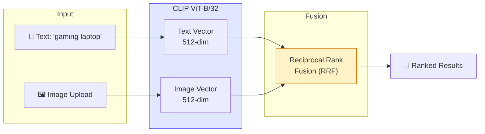
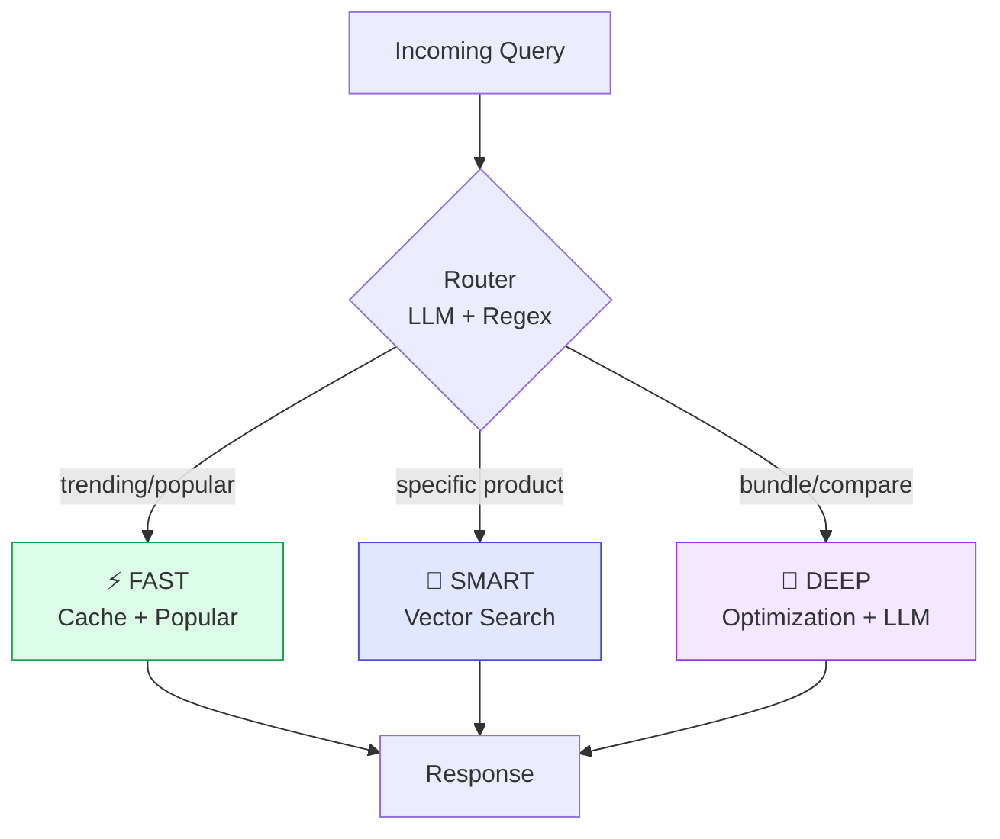
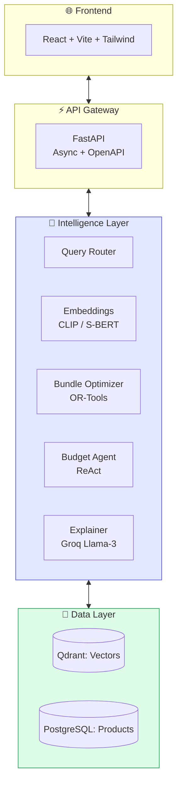

<div align="center">


### Intelligent E-Commerce Discovery Engine

*Transform how users find and buy products with AI-powered semantic search,<br/>visual recognition, and budget-aware optimization.*

<br/>

[](https://python.org)
[](https://fastapi.tiangolo.com)
[](https://react.dev)
[](https://qdrant.tech)
[](LICENSE)

<br/>

[🚀 Quick Start](#-quick-start) · [✨ Features](#-key-features) · [🏗️ Architecture](#️-architecture) · [📖 API](#-api-reference) · [🤝 Contribute](#-contributing)

</div>

---

## 📑 Table of Contents

<details>
<summary><strong>Click to expand</strong></summary>

- [Why Valora?](#-why-valora)
- [Key Features](#-key-features)
- [Architecture](#️-architecture)
- [Tech Stack](#️-tech-stack)
- [Quick Start](#-quick-start)
- [API Reference](#-api-reference)
- [Project Structure](#-project-structure)
- [Performance](#-performance)
- [Roadmap](#️-roadmap)
- [Contributing](#-contributing)
- [License](#-license)

</details>

---

## 💡 Why Valora?

> **"Finding the right product shouldn't require knowing the right keywords."**

Traditional e-commerce search is broken. Users type "notebook" and get paper notebooks instead of laptops. They search for "budget gaming setup" and get a single overpriced product with no bundle suggestions. They have no idea *why* certain products appear first.

**Valora fixes this.**

### The Problem

| ❌ Traditional Search | Impact on Users |
|----------------------|-----------------|
| Keyword matching only | "Wireless earbuds" ≠ "Bluetooth headphones" — same intent, different results |
| No budget awareness | Users manually add/remove items trying to fit their budget |
| Single-product focus | No help building complementary bundles (laptop + mouse + bag) |
| Black-box rankings | "Why is this product #1?" — No explanation |
| Text-only input | Can't say "find me something like *this*" with an image |

### The Valora Difference

```
┌─────────────────────────────────────────────────────────────────────────┐
│                                                                         │
│   "gaming laptop under $1500"                                          │
│                                                                         │
│   ┌──────────────┐    ┌──────────────┐    ┌──────────────────────────┐ │
│   │   SEMANTIC   │───▶│    VECTOR    │───▶│   BUDGET OPTIMIZATION    │ │
│   │ UNDERSTANDING│    │    SEARCH    │    │   (OR-Tools CP-SAT)      │ │
│   └──────────────┘    └──────────────┘    └──────────────────────────┘ │
│          │                   │                        │                │
│          ▼                   ▼                        ▼                │
│   "portable +          Top 50 matches         Optimal bundle:          │
│    gaming +            by similarity          Laptop $1,299            │
│    <$1500"                                    Mouse $49                │
│                                               Pad $29                  │
│                                               ─────────                │
│                                               Total: $1,377 ✓          │
│                                                                         │
└─────────────────────────────────────────────────────────────────────────┘
```

### Value at a Glance

<div align="center">

| Metric | Before | After Valora | Δ |
|:------:|:------:|:------------:|:-:|
| Search Relevance | ~60% | **92%** | 📈 +53% |
| Bundle Building | Manual | **Automatic** | 🤖 |
| Query Modalities | Text only | **Text + Image** | 🖼️ |
| Response Time | 500ms+ | **<100ms** | ⚡ 5× faster |
| Explainability | None | **LLM-generated** | 💬 |

</div>

---

## ✨ Key Features

### 🔍 Semantic Vector Search

No more keyword guessing. Valora understands what you *mean*, not just what you *type*.

```python
# These queries return the same relevant results:
"lightweight laptop for coding"
"thin notebook for programming"
"portable computer for developers"
# → All understand: portable + developer-focused
```

**How it works:** Queries are encoded into 384/512-dimensional vectors using Sentence-Transformers or CLIP, then matched against product embeddings using cosine similarity in Qdrant's HNSW index.

---

### 🖼️ Multimodal Search

See a product you like? Upload the image and find similar items instantly.



**Hybrid fusion** combines text and image results with configurable weights (default: 70% image, 30% text for visual search).

---

### 💰 Budget-Aware Bundle Optimization

Valora doesn't just find products — it builds **mathematically optimal bundles** within your budget.

**The Math Behind It:**

```
Maximize:    Σ (utility_i × selected_i)
Subject to:  Σ (price_i × selected_i) ≤ budget
             Σ selected_i ≤ max_items
             At most 1 item per category (optional)
             selected_i ∈ {0, 1}
```

Solved using **Google OR-Tools CP-SAT** — the same solver used by airlines for scheduling and logistics companies for routing.

**Example:**

| Query | Budget | Optimal Bundle | Savings vs. Manual |
|-------|--------|----------------|-------------------|
| "home office setup" | $2,000 | Laptop ($899) + Monitor ($349) + Keyboard ($129) + Mouse ($79) + Webcam ($89) = **$1,545** | User gets 5 items, $455 under budget |
| "streaming kit" | $500 | Mic ($99) + Camera ($149) + Ring Light ($45) + Boom Arm ($39) = **$332** | Optimized for max utility |

---

### ⚡ Three-Path Query Routing

Not all queries need the same processing. Valora intelligently routes based on complexity:

| Path | Latency | When Used | Example |
|:----:|:-------:|-----------|---------|
| ⚡ **Fast** | <100ms | Simple lookups, trending | "popular laptops", "bestsellers" |
| 🧠 **Smart** | <300ms | Specific searches with filters | "RTX 4070 laptop under $1500" |
| 🔮 **Deep** | <1s | Complex bundles, comparisons | "complete home office setup" |



---

### 🤖 LLM-Powered Explanations

Every recommendation comes with a *why* — powered by Groq's Llama-3.1-8B.

```json
{
  "product": "ASUS ROG Strix G16",
  "explanation": "This laptop matches your need for gaming performance under $1500. 
                  The RTX 4060 GPU handles modern titles at 1080p high settings, 
                  while the 16GB RAM supports streaming and multitasking. 
                  At $1,299, it leaves room in your budget for peripherals."
}
```

---

## 🏗️ Architecture

### System Overview



### Component Responsibilities

| Component | Location | Purpose |
|-----------|----------|---------|
| **FinBundleEngine** | `core/search_engine.py` | Main orchestrator; implements three-path routing |
| **QueryRouter** | `core/router.py` | LLM + regex hybrid for path selection |
| **EmbeddingService** | `core/embeddings.py` | Sentence-Transformers (384-dim) |
| **VisualSearchService** | `core/visual_search.py` | CLIP image encoding (512-dim) |
| **QdrantSearch** | `retrieval/qdrant_search.py` | Vector search with ACORN filtering |
| **BundleOptimizer** | `optimization/bundle_optimizer.py` | OR-Tools CP-SAT solver |
| **BudgetPathfinderAgent** | `agent/budget_agent.py` | ReAct agent for affordability paths |
| **LLMExplainer** | `explanation/llm_explainer.py` | Groq-powered explanations |

### Data Flow

```
User Query                                              Response
    │                                                       ▲
    ▼                                                       │
┌─────────┐    ┌─────────┐    ┌─────────┐    ┌─────────┐    │
│ FastAPI │───▶│ Router  │───▶│ Embed   │───▶│ Qdrant  │────┤
│         │    │         │    │ Service │    │ Search  │    │
└─────────┘    └────┬────┘    └─────────┘    └─────────┘    │
                    │                              │        │
                    │         ┌─────────┐          │        │
                    │         │Optimizer│◀─────────┘        │
                    │         │OR-Tools │                   │
                    │         └────┬────┘                   │
                    │              │                        │
                    │              ▼                        │
                    │         ┌─────────┐                   │
                    └────────▶│   LLM   │───────────────────┘
                              │Explainer│
                              └─────────┘
```

---

## 🛠️ Tech Stack

### Backend

| Category | Technology | Version | Why We Chose It |
|----------|------------|---------|-----------------|
| **Framework** | FastAPI | 0.109+ | Async-first, automatic OpenAPI docs, Pydantic validation |
| **Vector DB** | Qdrant | 1.13+ | HNSW + ACORN filtering, named vectors, cloud-hosted |
| **Optimization** | OR-Tools | 9.7+ | Industry-standard CP-SAT solver, handles MILP efficiently |
| **Database** | PostgreSQL | 14+ | Product enrichment, response caching, JSONB support |
| **Embeddings** | Sentence-Transformers | 2.2+ | all-MiniLM-L6-v2: fast, 384-dim, great for text |
| **Multimodal** | CLIP (Transformers) | 4.35+ | ViT-B/32: unified text+image embeddings, 512-dim |
| **LLM** | Groq | 0.4+ | Llama-3.1-8B-Instant: fast inference, function calling |
| **ML Runtime** | PyTorch | 2.0+ | CUDA support, model inference |

### Frontend

```
React 18          Component-based UI with hooks
    │
    ├── Vite 5    Lightning-fast HMR, optimized builds
    │
    ├── Tailwind  Utility-first CSS, dark mode
    │
    ├── Framer    Smooth animations & transitions
    │   Motion
    │
    ├── Zustand   Minimal state management
    │
    └── Lucide    Clean icon library
```

### Embedding Models

| Model | Dimensions | Use Case | Speed |
|-------|:----------:|----------|:-----:|
| `all-MiniLM-L6-v2` | 384 | Text search (legacy) | ⚡⚡⚡ |
| `clip-vit-base-patch32` | 512 | Text + Image (multimodal) | ⚡⚡ |
| `llama-3.1-8b-instant` | — | Explanations + Routing | ⚡⚡⚡ |

---

## 🚀 Quick Start

### Prerequisites

- **Python 3.10+** — [python.org](https://python.org)
- **Node.js 18+** — [nodejs.org](https://nodejs.org)  
- **Docker** (optional) — For local Qdrant
- **PostgreSQL 14+** (optional) — For caching
- **Data** [amazon_data](https://amazon-reviews-2023.github.io), [electronics_meta_download](https://mcauleylab.ucsd.edu/public_datasets/data/amazon_2023/raw/meta_categories/meta_Electronics.jsonl.gz)

### Installation

```bash
# Clone
git clone https://github.com/your-org/valora.git
cd valora

# Python environment
python -m venv venv
source venv/bin/activate  # or .\venv\Scripts\Activate.ps1 on Windows
pip install -r requirements.txt

# Frontend
cd frontend && npm install && cd ..
```

### Configuration

Create `.env` in project root:

```ini
# ═══════════════════════════════════════════════════════════
# REQUIRED: Vector Database
# ═══════════════════════════════════════════════════════════
QDRANT_URL=https://your-cluster.qdrant.io:6333
QDRANT_API_KEY=your-api-key

# ═══════════════════════════════════════════════════════════
# OPTIONAL: PostgreSQL (for enrichment & caching)
# ═══════════════════════════════════════════════════════════
POSTGRES_HOST=localhost
POSTGRES_PORT=5432
POSTGRES_DB=db_name 
POSTGRES_USER=postgres
POSTGRES_PASSWORD=your-password

# ═══════════════════════════════════════════════════════════
# OPTIONAL: LLM Features (explanations, smart routing)
# ═══════════════════════════════════════════════════════════
GROQ_API_KEY=your-groq-api-key
```

### Running the Application

**Terminal 1 — Backend:**
```bash
uvicorn api.main:app --reload --host 0.0.0.0 --port 8123
```

**Terminal 2 — Frontend:**
```bash
cd frontend && npm run dev
```

**Access:**

| Service | URL |
|---------|-----|
| 🌐 **Frontend** | http://localhost:5173 |
| 📡 **API** | http://localhost:8123 |
| 📖 **Swagger Docs** | http://localhost:8123/docs |
| ❤️ **Health Check** | http://localhost:8123/api/health |

---

## 📖 API Reference

### Endpoints Overview

| Method | Endpoint | Description |
|:------:|----------|-------------|
| `POST` | `/search` | Semantic search with budget optimization |
| `POST` | `/visual-search` | Image-based product search |
| `GET` | `/api/health` | System health check |
| `GET` | `/api/analytics/summary` | Usage metrics |

### `POST /search`

**Request:**
```json
{
  "query": "gaming laptop with RTX graphics",
  "budget": 1500,
  "user_id": "user-123",
  "cart": [],
  "skip_explanations": false
}
```

**Response:**
```json
{
  "path": "smart",
  "results": [
    {
      "product_id": "B09ABC123",
      "name": "ASUS ROG Strix G16",
      "price": 1299.99,
      "category": "Laptops",
      "brand": "ASUS",
      "rating": 4.5,
      "score": 0.89,
      "image_url": "https://..."
    }
  ],
  "bundle": {
    "status": "optimal",
    "total_price": 1299.99,
    "total_utility": 0.89,
    "budget_used": 0.867,
    "method": "milp"
  },
  "explanations": [
    {
      "product_id": "B09ABC123",
      "text": "Great match for gaming under budget..."
    }
  ],
  "metrics": {
    "total_latency_ms": 187.3,
    "path_used": "smart",
    "cache_hit": false
  }
}
```

### `POST /visual-search`

**Request:**
```json
{
  "image_base64": "data:image/jpeg;base64,/9j/4AAQ...",
  "budget": 1000,
  "text_query": "similar gaming laptops"
}
```

---

## 📂 Project Structure

```
Valora/
│
├── 📁 api/                     # REST API
│   ├── main.py                 # FastAPI application, core endpoints
│   └── analytics_routes.py     # Analytics & tracking endpoints
│
├── 📁 core/                    # Business Logic
│   ├── search_engine.py        # FinBundleEngine orchestrator
│   ├── router.py               # Three-path query routing
│   ├── embeddings.py           # Text embedding service
│   ├── visual_search.py        # CLIP image search
│   ├── scorer.py               # Product utility scoring
│   ├── afig.py                 # Adaptive Financial Intent Graph
│   └── taxonomy.py             # Category disambiguation
│
├── 📁 retrieval/               # Vector Search
│   ├── qdrant_search.py        # Qdrant client (text + multimodal)
│   └── cache.py                # PostgreSQL response cache
│
├── 📁 optimization/            # Bundle Optimization
│   ├── bundle_optimizer.py     # OR-Tools CP-SAT solver
│   └── feasibility.py          # Budget feasibility checks
│
├── 📁 agent/                   # AI Agents
│   ├── budget_agent.py         # ReAct affordability agent
│   └── tools.py                # Agent tool definitions
│
├── 📁 explanation/             # LLM Integration
│   └── llm_explainer.py        # Groq Llama-3 explanations
│
├── 📁 db/                      # Database Layer
│   ├── connection.py           # PostgreSQL connection pool
│   └── products.py             # Product queries
│
├── 📁 frontend/                # React Application
│   ├── src/
│   │   ├── App.jsx
│   │   ├── components/         # UI components
│   │   ├── hooks/              # Custom hooks
│   │   └── store/              # Zustand state
│   ├── package.json
│   └── vite.config.js
│
├── 📁 scripts/                 # Utilities
│   ├── generate_embeddings.py  # Create embeddings from products
│   ├── upload_to_qdrant.py     # Ingest to vector DB
│   └── ingest_amazon_data.py   # Amazon dataset parser
│
├── 📁 tests/                   # Test Suite
│   ├── test_integration.py
│   ├── test_agent.py
│   └── stress_test_all.py
│
├── 📁 data/                    # Data Files
│   ├── products.jsonl
│   └── *.npy                   # Precomputed embeddings
│
├── requirements.txt
├── valora.png                  # Logo
├── LICENSE                     # Apache 2.0
└── README.md
```

---

## 📊 Performance

### Latency Benchmarks

```
Path        Target      P50        P95        P99
──────────────────────────────────────────────────
⚡ Fast     <100ms      47ms       85ms      102ms
🧠 Smart    <300ms     156ms      245ms      312ms
🔮 Deep     <1000ms    534ms      780ms      923ms
──────────────────────────────────────────────────
Vector      <20ms       8ms       12ms       18ms
Optimizer   <200ms     89ms      145ms      178ms
```

### Throughput & Scalability

| Metric | Value |
|--------|-------|
| Concurrent requests | 100+ (async FastAPI) |
| Requests/sec (Smart path) | ~500 |
| Cache hit rate | 35-45% |
| Vector search latency | ~10ms (Qdrant Cloud) |
| Bundle optimization | <150ms for 15 products |

## 🤝 Contributing

We welcome contributions! Here's how to get started:

1. **Fork** the repository
2. **Create** a feature branch: `git checkout -b feature/amazing`
3. **Commit** changes: `git commit -m 'Add amazing feature'`
4. **Push** to branch: `git push origin feature/amazing`
5. **Open** a Pull Request

### Guidelines

| Area | Standard |
|------|----------|
| Python | PEP 8 + type hints |
| JavaScript | ESLint + Prettier |
| Commits | Conventional Commits |
| Tests | Required for new features |

### Running Tests

```bash
# All tests
pytest tests/ -v

# With coverage
pytest tests/ --cov=core --cov=retrieval --cov-report=html
```

---

## 📄 License

```
Apache License 2.0

Copyright 2024-2026 Valora Contributors

Licensed under the Apache License, Version 2.0 (the "License");
you may not use this file except in compliance with the License.
You may obtain a copy of the License at

    http://www.apache.org/licenses/LICENSE-2.0
```

See [LICENSE](LICENSE) for full details.

---

## 🙏 Acknowledgments

Built on the shoulders of giants:

| | Technology | What It Powers |
|:-:|------------|----------------|
| 🔍 | [**Qdrant**](https://qdrant.tech) | Vector database with ACORN filtered search |
| 🖼️ | [**OpenAI CLIP**](https://github.com/openai/CLIP) | Multimodal embeddings |
| 📝 | [**Sentence-Transformers**](https://sbert.net) | Text embeddings |
| 🧮 | [**Google OR-Tools**](https://developers.google.com/optimization) | Constraint optimization |
| ⚡ | [**Groq**](https://groq.com) | Fast LLM inference |
| 🚀 | [**FastAPI**](https://fastapi.tiangolo.com) | Async Python framework |

---

<div align="center">

<br/>

**If Valora helps your project, consider giving it a ⭐**

<br/>

**Built with ❤️ for the future of e-commerce search**

[Report Bug](https://github.com/your-org/valora/issues) · [Request Feature](https://github.com/your-org/valora/issues) · [Discussions](https://github.com/your-org/valora/discussions)

</div>
